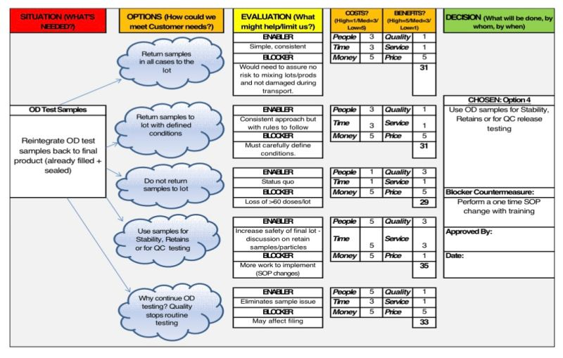
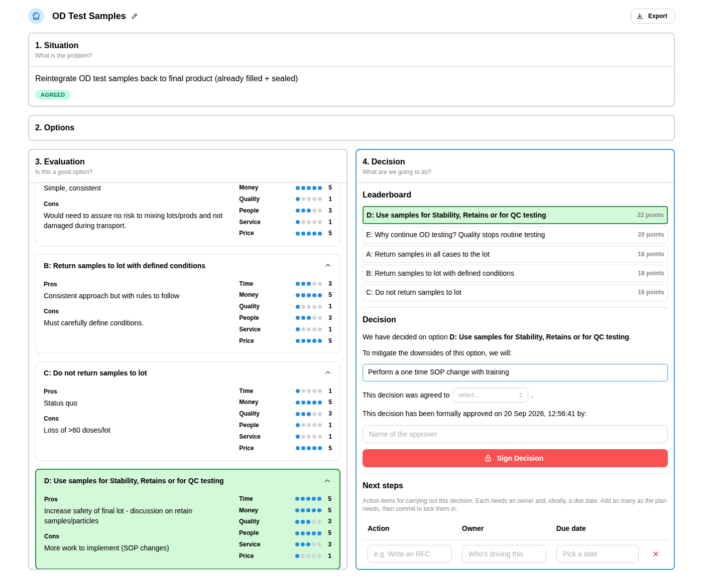

# crystalline

Make good decisions efficiently.

This tool guides you (or a team) through making decisions in a set, sequential process:

- Problem clarification
- Idea generation
- Option evaluation
- Final decision

This simplifies each stage, by focusing on the key skills uniquely required at each step. For example, creativity is *needed* for idea generation, but disruptive during evaluation.

## Origin

The Crystal Ball is a decision making process [developed by Bob Darius](https://www.linkedin.com/posts/activity-7305992104365678592-QWPq), and originally inspired by Dr. Edward de Bono's *Six Thinking Hats*.
Originally a physical whiteboard exercise, this repo turns it into an interactive, collaborative tool.

The same phase-by-phase structure, in the app today:

