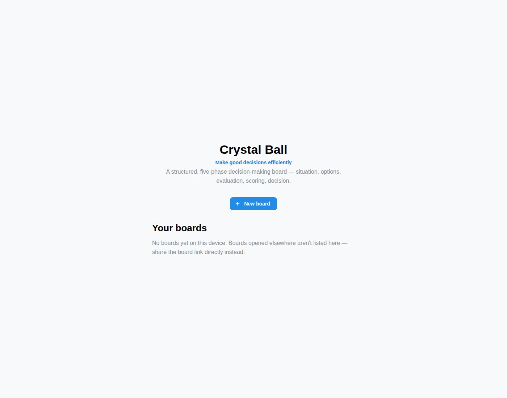
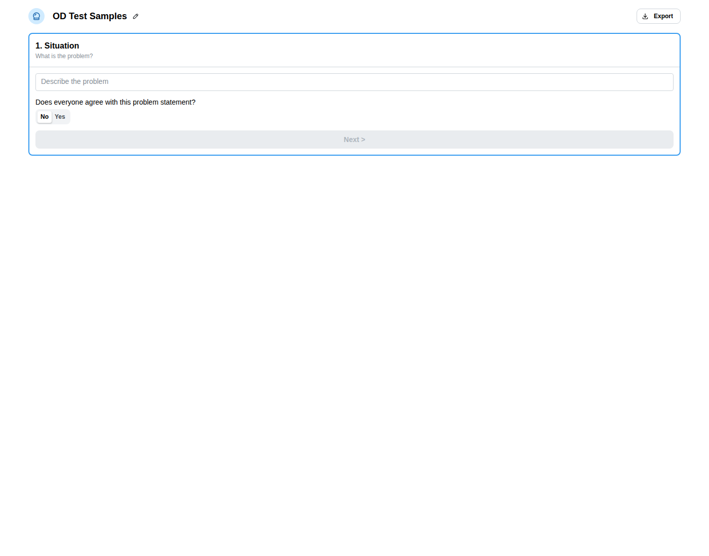
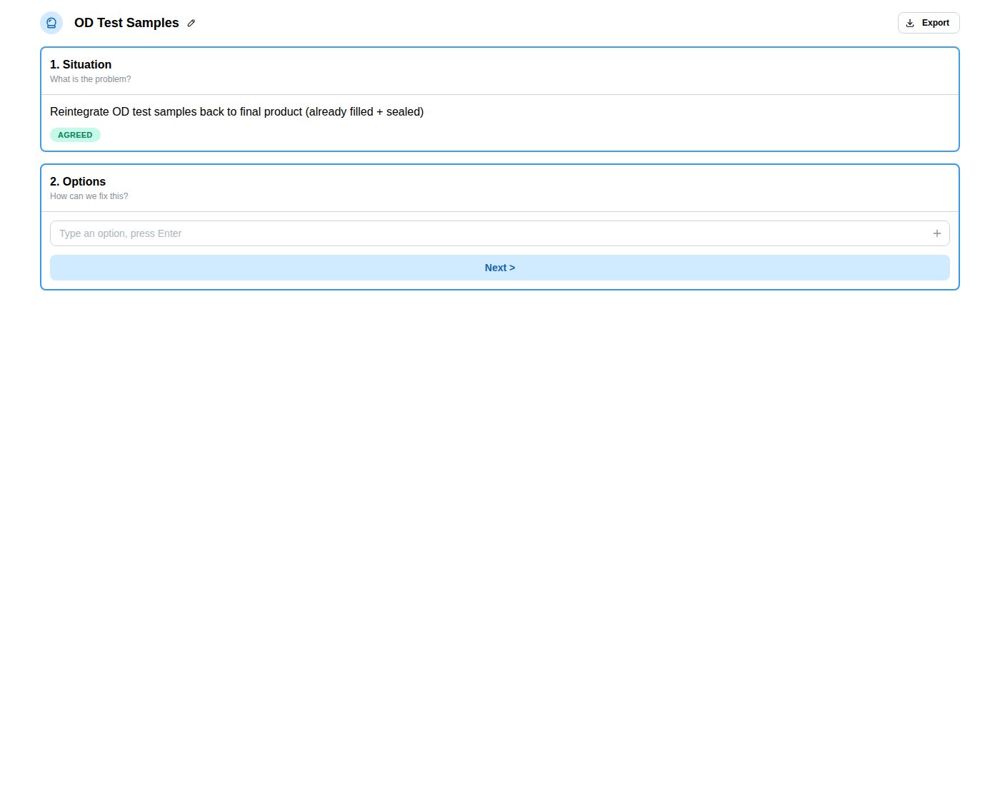
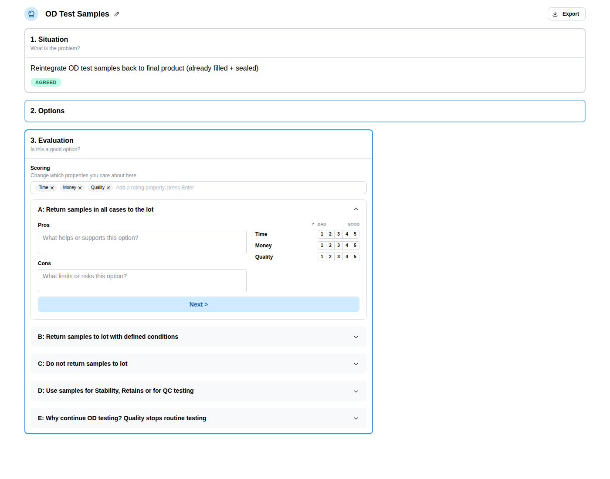
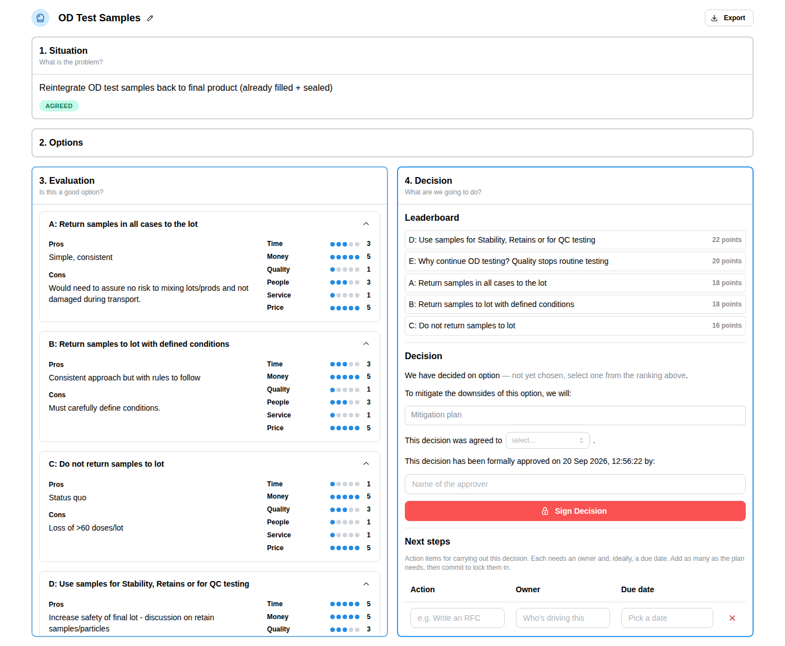
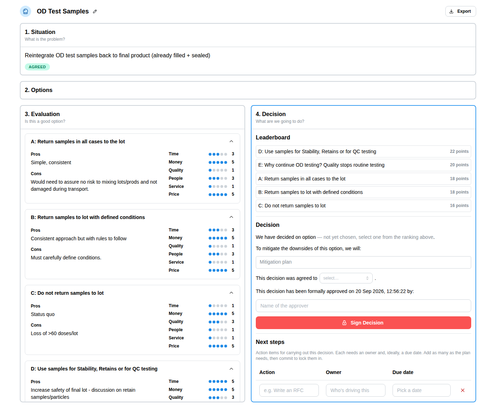
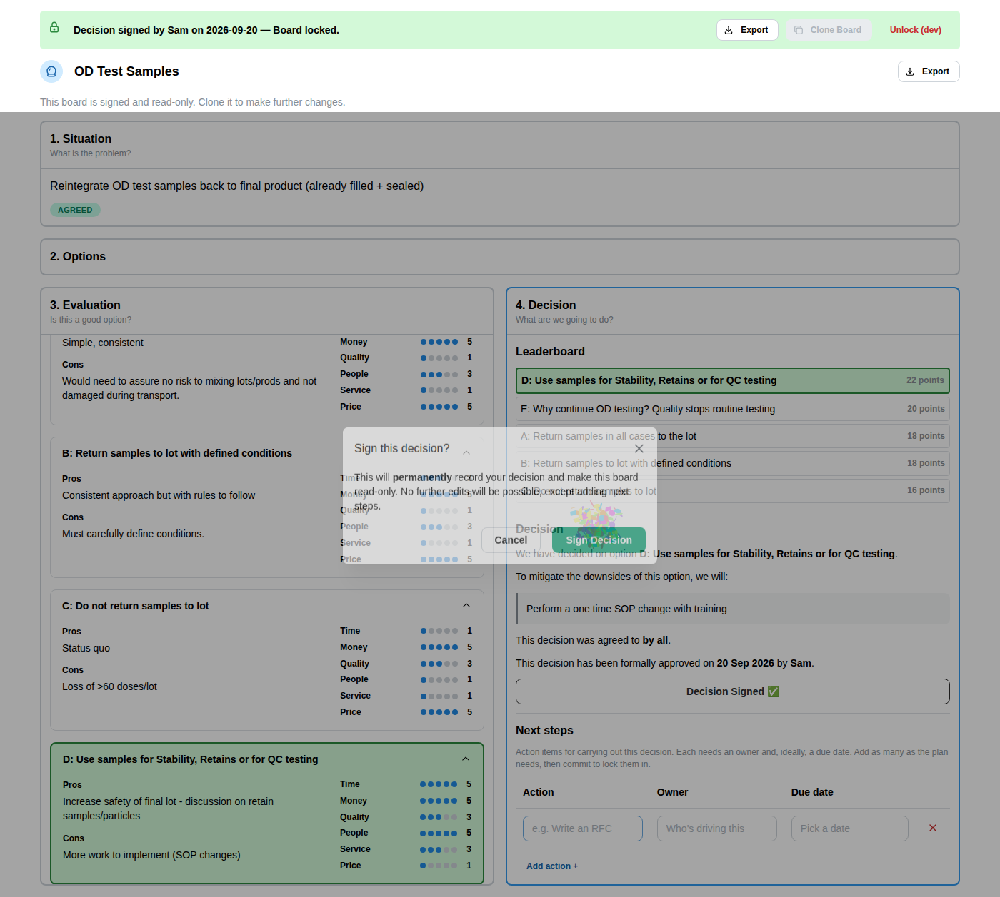
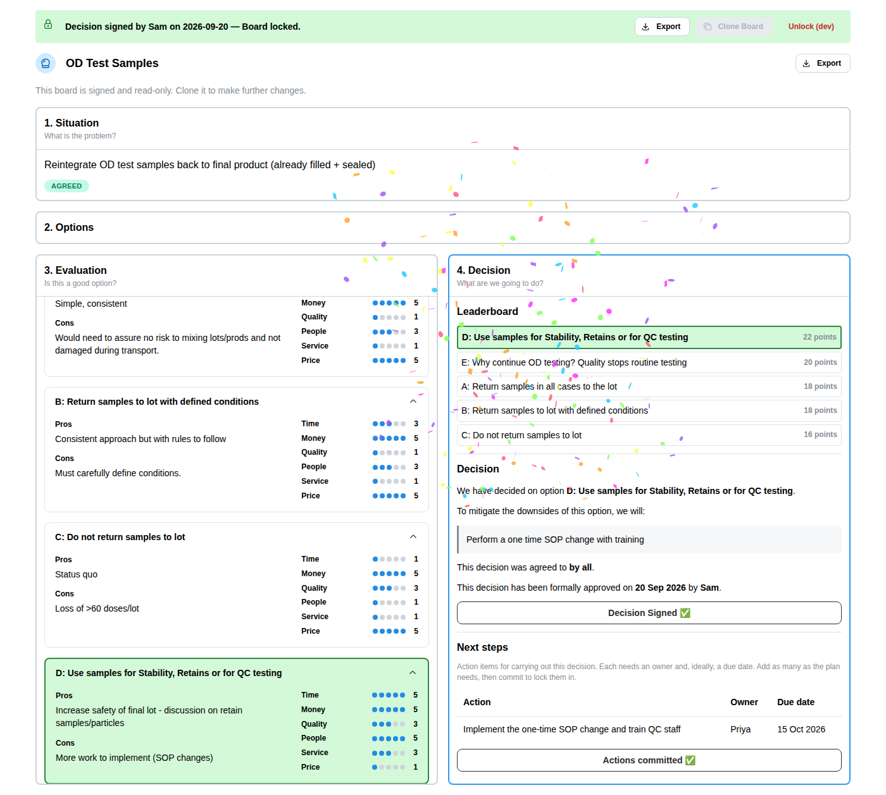
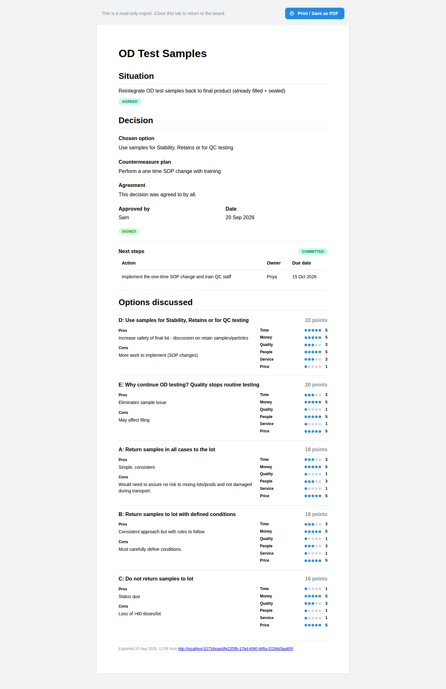

# Walkthrough

A screenshot tour of the main user journey, one phase at a time, using the real worked example
from `assets/original-whiteboard-example.png` (a pharma/QC decision about what to do with OD test
samples) — text and scores are verbatim off that board. These images are generated, not
hand-curated — regenerate them any time with `npm run docs:screenshots` (see
`scripts/capture-doc-screenshots.sh`), which runs the same tested step sequence as
`scripts/smoke-test.mjs`, so they can never drift from what's actually verified to work.

## 1. Home page

The landing page: a one-line pitch, a **New board** button, and a list of boards created on this
device (empty here, since this is a fresh walkthrough run).

## 2. Create a board

Creating a board opens straight into phase 1, **Situation** — the problem statement input and an
agreement check, with the rest of the phases appearing as the team moves through them.

## 3. Phase 1 — Situation

The team frames the problem in one or two sentences and confirms everyone agrees with it before
moving on.

## 4. Phase 2 — Options

With the problem framed, the team brainstorms options — no judgment yet, just a running list.
Once options are in, the board advances into phase 3, where each option gets its own
accordion panel.

## 5. Phase 3 — Evaluation

Each option's panel merges its pros/cons (Good/Bad) with a set of rating properties, scored 1–5
side by side — judgment finally allowed, but scoped to one option at a time. The board only ships
three rating properties by default (Time, Money, Quality); here the other three the whiteboard
example actually scores against (People, Service, Price) have been added via the "Scoring" picker
at the top of the column, so all six show up per option.

## 6. Phase 4 — Decision leaderboard

Evaluation scores roll up into a ranked leaderboard, highest total first — here "Use samples for
Stability, Retains or for QC testing" (22 points) tops the ranking, matching the whiteboard's own
"CHOSEN: Option 4". The Evaluation column stays visible alongside it as a read-only reference.

## 7. Decision — choose, countermeasure

The team selects the winning option from the leaderboard and records a plan to mitigate its
downsides — here, the whiteboard's own "Blocker Countermeasure".

## 8. Decision — agree, sign

Sets who the decision was agreed by, names an approver, and signs. Signing locks the board
(read-only except for Next Steps) and triggers a small celebration. Clicking **Sign Decision**
with a field still missing highlights it instead of silently doing nothing — the confirmation
modal only opens once everything's filled in.

## 9. Next steps — commit to action

Signing hands focus to Next Steps, where the team lists concrete follow-up actions with an owner
and due date each, then commits to lock the plan in.

## 10. Export view

Any board links to a read-only, printable export — the full record of the decision: situation,
chosen option, countermeasure, agreement, approval, next steps, and every option's evaluation
detail, ranked by score.

