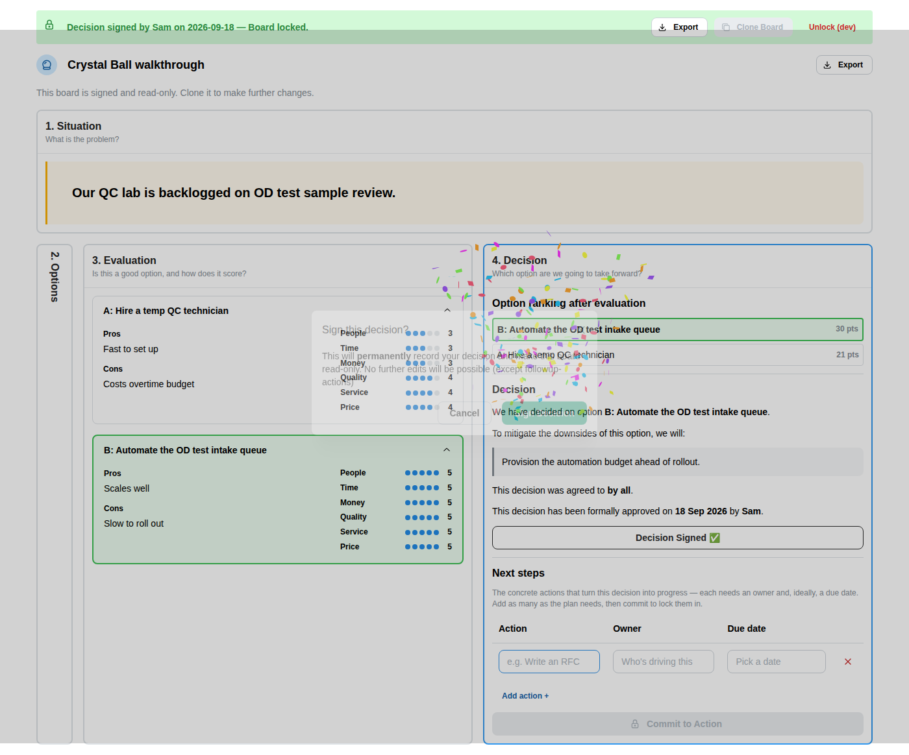
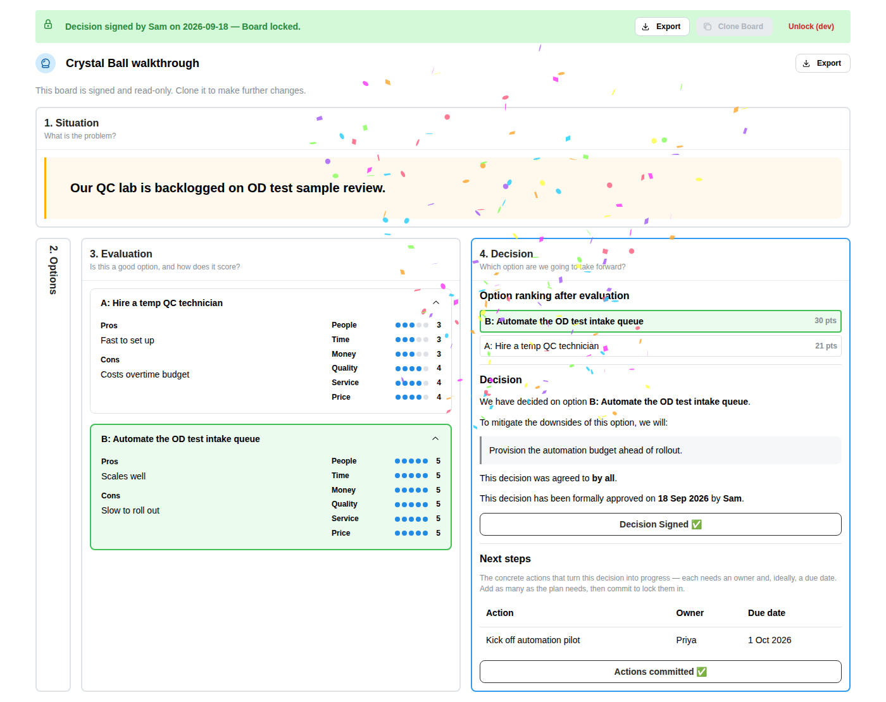

# Walkthrough

A screenshot tour of the main user journey, one phase at a time. These images are generated,
not hand-curated — regenerate them any time with `npm run docs:screenshots` (see
`scripts/capture-doc-screenshots.sh`), which runs the same tested step sequence as
`scripts/smoke-test.mjs`, so they can never drift from what's actually verified to work.

## 1. Home page

The landing page: a one-line pitch, a **New board** button, and a list of boards created on this
device (empty here, since this is a fresh walkthrough run).

## 2. Create a board

Creating a board opens straight into phase 1, **Situation** — the problem statement input and an
agreement check, with the rest of the phases appearing as the team moves through them.

## 3. Phase 1 — Situation

The team frames the problem in one or two sentences and confirms everyone agrees with it before
moving on.

## 4. Phase 2 — Options

With the problem framed, the team brainstorms options — no judgment yet, just a running list.
Once options are in, the board advances into phase 3, where each option gets its own
accordion panel.

## 5. Phase 3 — Evaluation

Each option's panel merges its pros/cons (Good/Bad) with a set of rating properties (People,
Time, Money, Quality, Service, Price), scored 1–5 side by side — judgment finally allowed, but
scoped to one option at a time.

## 6. Phase 4 — Decision leaderboard

Evaluation scores roll up into a ranked leaderboard, highest total first — here "Automate the OD
test intake queue" (30 points) outranks "Hire a temp QC technician" (21 points). The Evaluation
column stays visible alongside it as a read-only reference.

## 7. Decision — choose, mitigate, agree, sign

The team selects the winning option, records a mitigation plan for its downsides, sets who the
decision was agreed by, names an approver, and signs. Signing locks the board (read-only except
for Next Steps) and triggers a small celebration.

## 8. Next steps — commit to action

Signing hands focus to Next Steps, where the team lists concrete follow-up actions with an owner
and due date each, then commits to lock the plan in.

